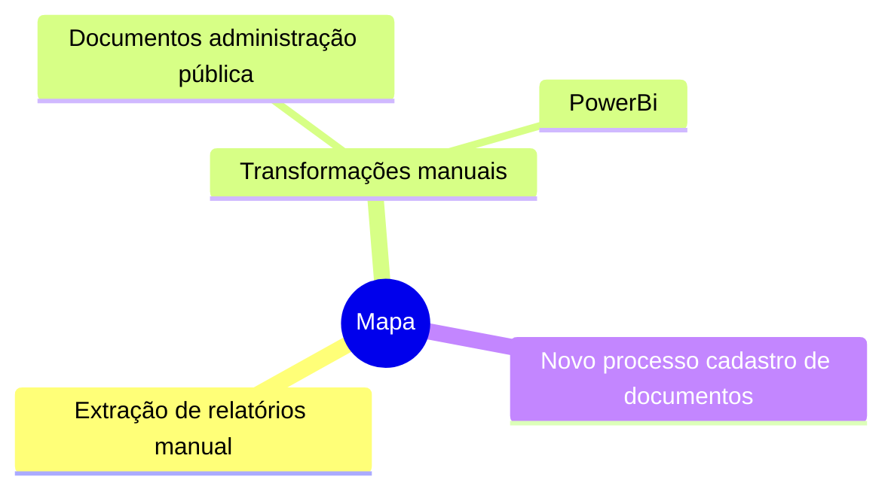

## Melhorias Mapa de Transformação

Note:
- Apresentação carreira e DCTA.

## Agenda
- Contextualização.
- Propostas.
- Pontos para dicussão.

## Contextualização
1. [Reunião apresentação do processo](https://suges-mg.github.io/handbook/atas/20230911_relatorio_mapa_transformacao/).
2. [Reunião apresentação novo Mapa de Transformação](https://suges-mg.github.io/handbook/atas/20230918_apresentacao_canais_digitais_mapa_transformacao/).
3. [Reunião cadastro novos documentos Portal MG](https://suges-mg.github.io/handbook/atas/20230918_reuniao_leyde_canais_digitais/).

## Extração Transformação e Carga

## Propostas

- ETL automático.
    - Obs.: Exigência §6º Art. 7º Lei [13.460](https://www.planalto.gov.br/ccivil_03/_ato2015-2018/2017/lei/l13460.htm#:~:text=%C2%A7%206%C2%BA-,Compete,-a%20cada%20ente) para abertura da base de serviços prestados em formato aberto.
- Retirada do botão "Cadastro de Outros Documentos."

Note:
- ETL exige acesso ao banco de dados - PRODEMG.
- [Age7](https://github.com/transparencia-mg/age7).

## Pontos para dicussão

- Benefícios:
  - Liberação de horas de trabalho DCCD e DCD.
  - Qualidade cadastro de serviços.
  - Cumprimento exigência legal de abertura de dados.

## Fim
