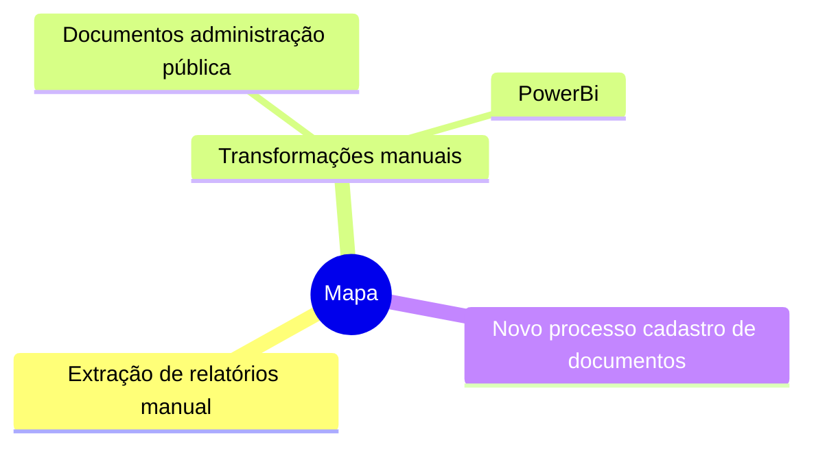

## Melhorias Mapa de Transformação

## Agenda
- Contextualização.
- Propostas.
- Pontos para dicussão.

## Contextualização
1. [Reunião apresentação do processo](https://suges-mg.github.io/handbook/atas/20230911_relatorio_mapa_transformacao/).
2. [Reunião apresentação novo Mapa de Transformação](https://suges-mg.github.io/handbook/atas/20230918_apresentacao_canais_digitais_mapa_transformacao/).
3. [Reunião cadastro novos documentos Portal MG]().

## Extração Transformação e Carga

## Fim
