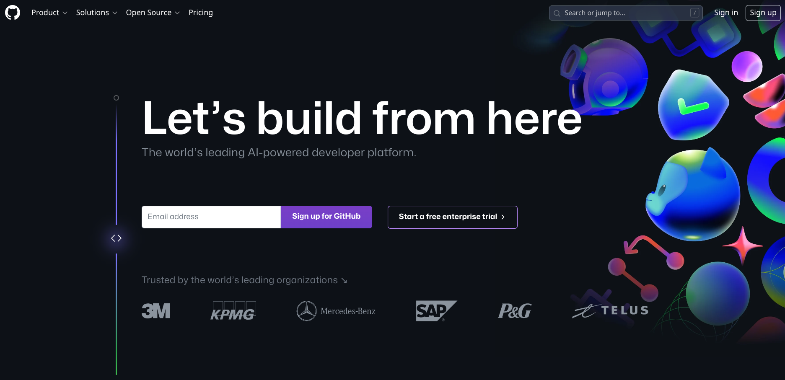
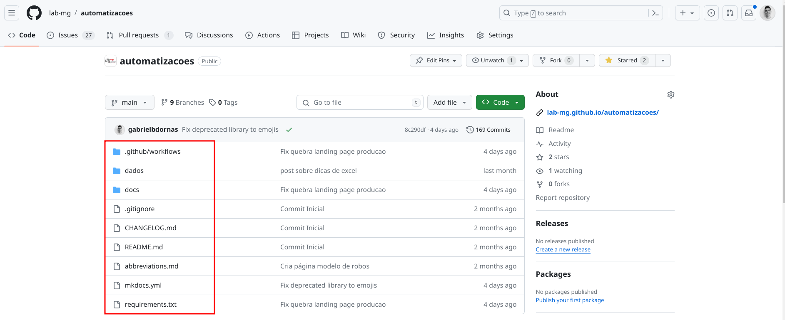
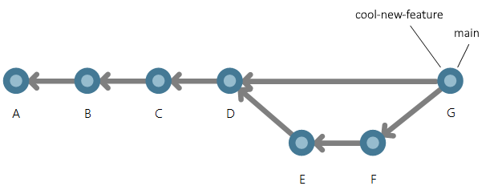
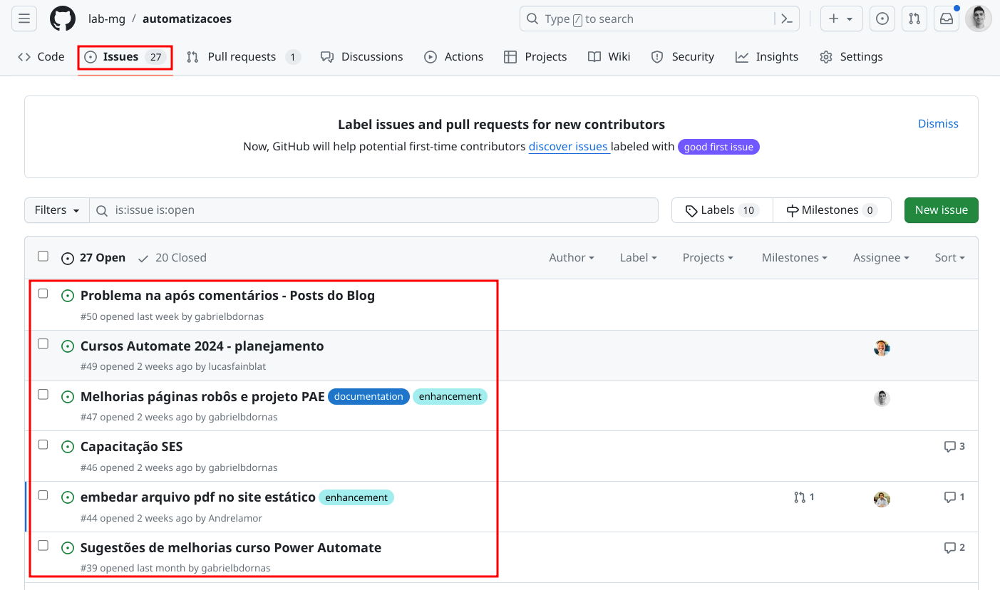
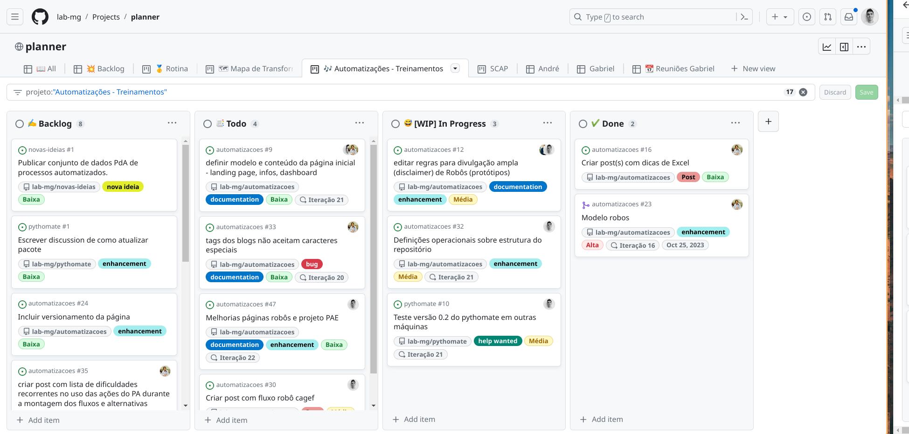

# Simplesmente

Note:
- Objetivo principal é apresentar o GitHub e não ensinar a utilizar.
- Gostaria da participação de todos e peço que façam perguntas a qualquer momento.
- Esta é a primeira versão da apresentação, portanto toda sugestão  para simplificar as explicações será bem vinda.
- Fonte é a minha cabeça.

## Agenda

- Pingos nos is.
- Exemplos.
- Pequeno mão na massa.
- Para casa.

Note:
- Demonstração geral da ferramenta.

## Pingos nos is

O que é [GitHub](https://github.com/)?

Note:
- Definição chatGPT: Ele é uma plataforma de desenvolvimento colaborativo baseada em nuvem que permite o gerenciamento de projetos, controle de versão usando Git e colaboração eficiente entre equipes.
- O GitHub é como uma rede social corporativa, onde podemos compartilhar arquivos e mensagens e acompanhar a evolução de nosso trabalho.
- GitHub oferece:
    - Armazenamento **organizado** de arquivos em nuvem.
    - Acompanhamento das versões destes arquivos (viagem no tempo).
    - Comunicação da equipe (gestão do conhecimento).
    - Gerenciamento de projetos.
- Mostrarei todos estas funcionalidades.

## Pingos nos is

Vocês conhecem o Octocat?

Note:
- Porque o mascote do GitHub é um octocat?
    - Ou gato com tentáculos.
    - A ideia foi criar um gato simpático para representar a comunidade que o utiliza.
    - Sendo este gato capaz de lidar com muitos projetos simultaneamente.
    - Os tentáculos sugerem a ideia de multitarefa, **exatamente nosso caso**.

## Pingos nos is

Na sua opinição, GitHub pode ser utilizado por quem?

Note:
- Amplamente utilizado para desenvolvimento de software.
- Software nada mais é que um conjunto organizado de arquivos de texto.
- Nosso trabalho é repleto de arquivos de texto.
- [Clay Shirky: How the Internet will (one day) transform government](https://www.youtube.com/watch?v=CEN4XNth61o):
    - Explica como desenvolvedores se comunicam e como isso permitiu a criação de projetos muito complexos.
    - Potencial para transformar, entre outros, nossos processos democráticos.

## Arquivos em nuvem

Note:
- Arquivos são organizados repositórios (pastas).
- Repositórios podem ser criados em:
    - Usuários: Uma pessoa específica.
    - Organizações: Entidade que pode incluir várias pessoas.
- Repositórios podem ser públicos ou privados.
- Ferramentas com a mesma funcionalidade:
    - One drive.
    - Google drive.
    - Dropbox.

## Arquivos em nuvem

https://github.com/user/repo

https://github.com/org/repo

Note:
- Entender esta estrutura facilita encontrar o trabalho desejado.
- Manter repositórios públicos facilita encontrar o trabalho desejado.
- Estrutura replicada localmente.

## Arquivos em nuvem

Qual a [organização](https://github.com/lab-mg) GitHub mais importante para nós a partir de agora?

Note:
- Será que você entendeu mesmo?

## Viagem no tempo

Note:
- Nosso delorean é o commit.
- É a operação que salva alterações feitas nos arquivos do repositório.
- Ou seja, é o registro de um ponto específico na história do seu projeto, criando um caminho simples de retorno a este ponto a qualquer momento.
- Ferramentas com a mesma funcionalidade:
    - Versões documentos Office.
    - Versões documentos Google.

## Viagem no tempo

Note:
- Branchs
- Isso ajuda a acabar com doc_v1, doc_v2, doc_v3.

## Comunicação

Note:
- Comunicação ocorre, na maioria das vezes, com auxílio de issues.
- Gosto de pensar em issues como questões, que podem ser:
    - Registro de nova tarefa.
    - Relato de erro.
    - Registro de uma ideia de melhoria.
- Benefícios:
    - Relacionar nova tarefa, erro ou ideia diretamente com os arquivos do repositório.
    - Atribuição de responsabilidade.
    - Incluir qualquer integrante da equipe na conversa.
    - Facilita resgate de informações.
- Podemos comparar um issue com um card no Trello.

## Gerenciamento de projetos

Note:
- Modo de organizar issues.
- Ferramentas com a mesma funcionalidade:
    - Trello.
    - Planner.
    - Project.

## Mas, afinal qual "the jump of the cat"?

Note:
- Sempre me perguntei porque eu gosto tanto do GitHub.
- Não sei se tenho a resposta certa.
- Mas penso que pode ser o encaixe de todas essas ferramentas em um só lugar.
- É o mesmo que ter o whatsapp e o Trello conversando com um OneDrive bala que te mostra a evolução do trabalho.

## Mão na massa

Note:
- [Template projeto ágil](https://github.com/transparencia-mg/template-projeto-agil).
- Autorizar actions realizar modificações repositório.
- Publicar página.
- Realizar alguma modificação na página inicial.

## Ainda tá confuso?

Note:
- É só uma questão de conhecimento e prática.

## Para casa

- Criar usuário GitHub.
- Ser convidado para organização [Lab-mg](https://github.com/lab-mg).
- Pensarmos um pequeno projeto para trabalharmos/praticarmos.

# Fim
