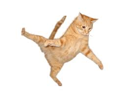

# Simplesmente

Note:
- Apresentar o GitHub e não ensinar a utilizar.
- Participação de todos e aberto a perguntas a qualquer momento.
- Anotar sugestões para simplificação das explicações.

## Agenda

- Pingos nos is.
- Exemplos.
- Pequeno mão na massa.
- Para casa.

Note:
- Trabalharemos com definições de ferramentas e conceitos.

## Pingos nos is

O que é [GitHub](https://github.com/)?

Note:
- O GitHub é como uma rede social corporativa, onde podemos compartilhar arquivos e mensagens e acompanhar a evolução de nosso trabalho.
- GitHub oferece:
    - Armazenamento organizado de arquivos em nuvem.
    - Acompanhamento das versões destes arquivos (viagem no tempo).
    - Comunicação da equipe (gestão do conhecimento).
    - Gerenciamento de projetos.
    - Analisaremos todos estes pontos.

## Pingos nos is

Qual o nome do seu mascote?

Note:
- Porque o mascote do GitHub é um octocat:
    - Ou gato de oito tentáculos.
    - A ideia foi criar um gato simpático para representar a comunidade que o utiliza.
    - Sendo este gato capaz de lidar com muitos projetos simultaneamente.
    - Os oito tentáculos sugerem multitarefa, exatamente nosso caso.

## Pingos nos is

Na sua opinição GitHub pode ser utilizado por quem?

Note:
- Amplamente utilizado para desenvolvimento de software.
- Software nada mais é que um conjunto organizado de arquivos de texto.
- Nosso trabalho é repleto de arquivos de texto.
- [Clay Shirky: How the Internet will (one day) transform government](https://www.youtube.com/watch?v=CEN4XNth61o)

## Arquivos em nuvem

Note:
- Arquivos são organizados repositórios (pastas).
- Repositórios podem ser criados em:
    - Usuários: Uma pessoa específica.
    - Organizações: Entidade que pode incluir várias pessoas.
- Repositórios podem ser públicos ou privados.
- Ferramentas com a mesma funcionalidade:
    - One drive.
    - Google drive.
    - Dropbox.

## Arquivos em nuvem

https://github.com/user/repo

https://github.com/org/repo

Note:
- Nesta vida, tudo é uma questão de organização!
- Entender esta estrutura facilita encontrar o trabalho desejado.
- Mander repositórios públicos facilita a encontrar o trabalho desejado.
- Estrutura replicada localmente.

## Arquivos em nuvem

Qual a [organização](https://github.com/lab-mg) GitHub mais importante para nós a partir de agora?

Note:
- Será que você entendeu mesmo?

## Viagem no tempo

## Viagem no tempo

Note:
- Um commit é uma operação que salva as alterações feitas em seus arquivos no repositório.
- Commit é o registro de um ponto específico na história do seu projeto.
- Ferramentas com a mesma funcionalidade:
    - Versões documentos Office.
    - Versões documentos Google.

## Comunicação

Note:
- Comunicação ocorre, na maioria das vezes, com auxílio de issues.
- Gosto de pensar em issues como questões, que podem ser:
    - Registro de nova tarefa.
    - Relato de erro.
    - Registro de uma idéia de melhoria.
- Podemos comparar um issue com um card no Trello.
- Benefícios:
    - Relacionar nova tarefa, erro ou ideia diretamente com os arquivos.
    - Atribuição de responsabilidade.
    - Incluir qualquer integrante da equipe na conversa.
    - Facilita resgate de informações.

## Gerenciamento de projetos

Note:
- Modo de organizar issues
- Ferramentas com a mesma funcionalidade:
    - Trello.
    - Planner.
    - Project.

## Mas, afinal qual "the jump of the cat"?

Note:
- O encaixe de todas essas ferramentas.
- É o mesmo que ter o Trello conversando com um OneDrive bala que te mostra mudanças em arquivos.

## Mão na massa

## Ainda tá confuso

Note:
- É só uma questão de conhecimento e prática.

## Para casa

- Criar usuário GitHub.
- Ser convidado para organização [Lab-mg](https://github.com/lab-mg).
- Pensarmos um pequeno projeto para utilizarmos todas essas ferramentas.

# Fim
